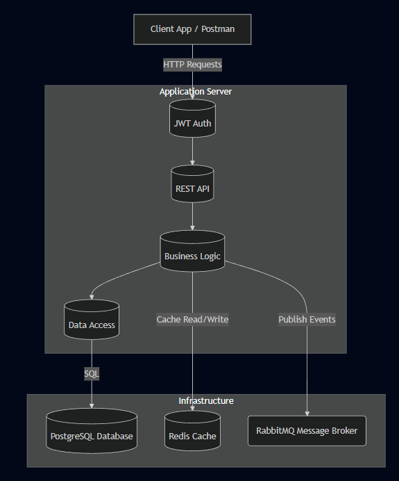
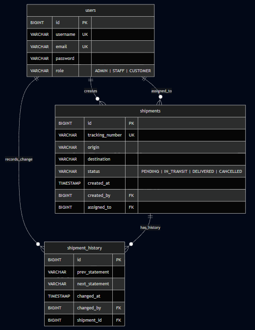

# Cargo Management API

## Overview

The **Cargo Management API** is a robust Spring Boot application designed to streamline logistics and cargo operations. It provides a secure and efficient backend for managing shipments, user assignments, and delivery tracking. The system is built with scalability in mind, utilizing caching strategies and asynchronous messaging.

## Technologies Used

*   **Java**: 25
*   **Framework**: Spring Boot 4.0.0
*   **Database**: PostgreSQL
*   **Security**: Spring Security + JWT (JSON Web Token)
*   **Caching**: Redis
*   **Messaging**: RabbitMQ
*   **Build Tool**: Maven

## Key Features

*   **Authentication & Authorization**: Secure user registration and login using JWT. Role-based access control (RBAC) with three distinct roles:
    *   `ADMIN`: Full system access.
    *   `STAFF`: Operational access for managing shipments.
    *   `CUSTOMER`: Access to view their own shipment history.
*   **Shipment Management**: Complete lifecycle management of shipments including creation, tracking, and status updates.
*   **Shipment Statuses**: Tracks shipments through various stages: `PENDING`, `IN_TRANSIT`, `DELIVERED`, `CANCELLED`.
*   **Asynchronous Processing**: Utilizes RabbitMQ for handling background tasks and notifications (e.g., shipment delivery events).
*   **Performance Optimization**: Implements Redis caching to improve data retrieval speeds for frequently accessed resources.
*   **Scheduled Tasks**: Includes a scheduler for automated background jobs.

## Prerequisites

Before running the application, ensure you have the following installed:

*   **JDK 25** (or a compatible version for your environment)
*   **Maven** (or use the provided `mvnw` wrapper)
*   **PostgreSQL** (running on port 5432)
*   **Redis** (running on port 6379)
*   **RabbitMQ** (running on port 5672)

## Configuration

The application uses `application.properties` for configuration. You can also use environment variables.

**Default Database Configuration:**
*   **URL**: `jdbc:postgresql://localhost:5432/cargo-management-api`
*   **Username**: `9a595bd8-7c32-4a81-9330-60f3459aae6a`
*   **Password**: `25d6ecde-29b2-4548-9b79-3e5e219d4390`

**Redis Configuration:**
*   **Host**: `localhost`
*   **Port**: `6379`

**RabbitMQ Configuration:**
*   **Host**: `localhost`
*   **Port**: `5672`
*   **Username/Password**: `quest` / `quest`

> **Note**: Ensure your local services match these credentials or update `src/main/resources/application.properties` accordingly.

## Installation & Running

1.  **Clone the repository:**
    ```bash
    git clone <repository-url>
    cd cargo-management-api
    ```

2.  **Start Infrastructure Services:**
    Ensure PostgreSQL, Redis, and RabbitMQ are up and running. If you have Docker, you can run them easily:
    ```bash
    # Example for Postgres
    docker run --name cargo-postgres -e POSTGRES_DB=cargo-management-api -e POSTGRES_USER=... -e POSTGRES_PASSWORD=... -p 5432:5432 -d postgres
    
    # Example for Redis
    docker run --name cargo-redis -p 6379:6379 -d redis
    
    # Example for RabbitMQ
    docker run --name cargo-rabbitmq -p 5672:5672 -p 15672:15672 -d rabbitmq:3-management
    ```

3.  **Build the project:**
    ```bash
    ./mvnw clean install
    ```

4.  **Run the application:**
    ```bash
    ./mvnw spring-boot:run
    ```

The API will be available at `http://localhost:8080`.

## API Endpoints

Postman Collection: https://conquistadorcan-0c68cbb1-9243660.postman.co/workspace/MFC's-Workspace~f42a3f3d-c2dd-4016-8a1a-82cf4a62dbd0/collection/50458080-3bf9cba2-0d3b-48c2-a332-1431a41efea2?action=share&creator=50458080&active-environment=50458080-a2678eef-3efd-46ba-9f1e-6bd3478148d7

### Authentication (`/auth` likely)
*   Register: `POST /auth/register`
*   Login: `POST /auth/login`

### Users (`/users` or `/admin`)
*   Manage users (Admin only)
*   View profile

### Shipments (`/shipments`)
*   Create Shipment
*   Update Status
*   Assign to Staff
*   View History

*(Check the `controller` package for exact endpoint paths)*

## Project Structure

```
src/main/java/com/mfc/logistics/cargo_management_api
├── config/       # Security, Redis, RabbitMQ, Scheduler configs
├── controller/   # REST Controllers
├── dto/          # Data Transfer Objects
├── enums/        # Enumerations (UserRole, ShipmentStatus)
├── model/        # JPA Entities
├── repository/   # Data Access Layer
└── service/      # Business Logic
```

## Diagrams

